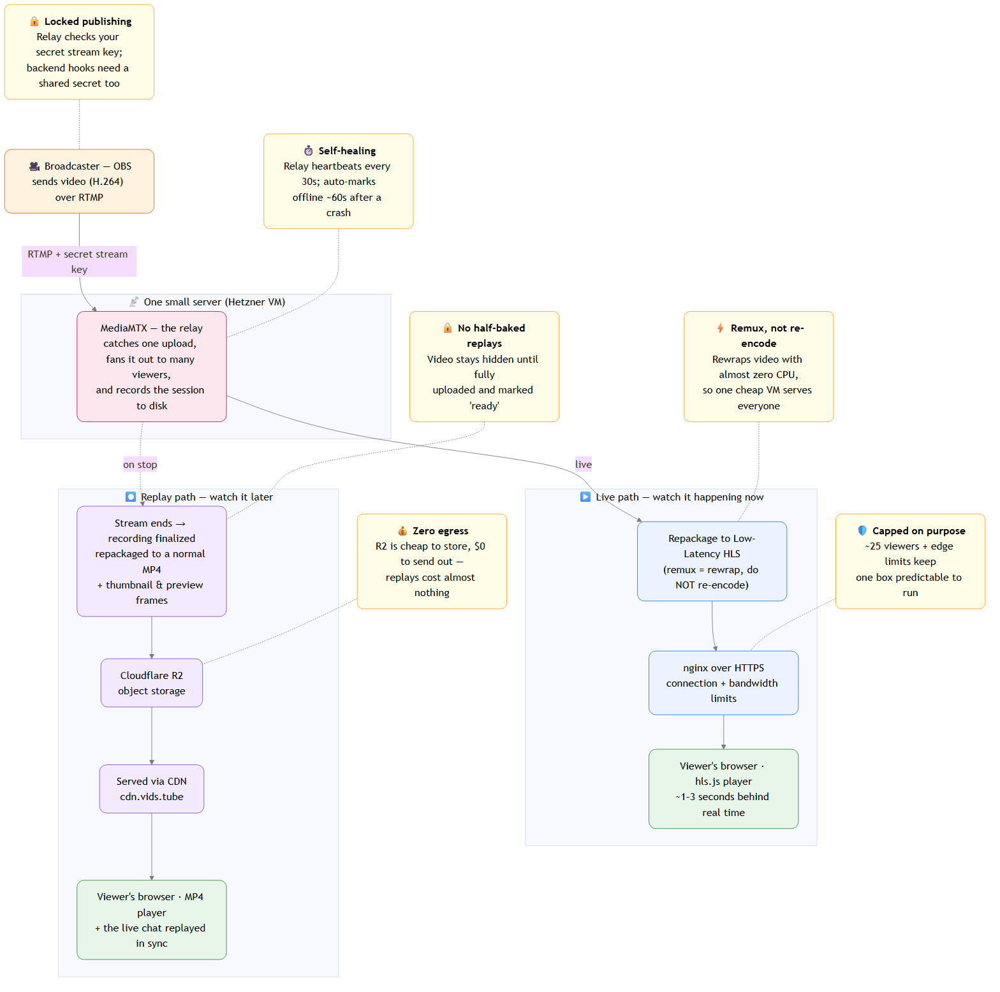
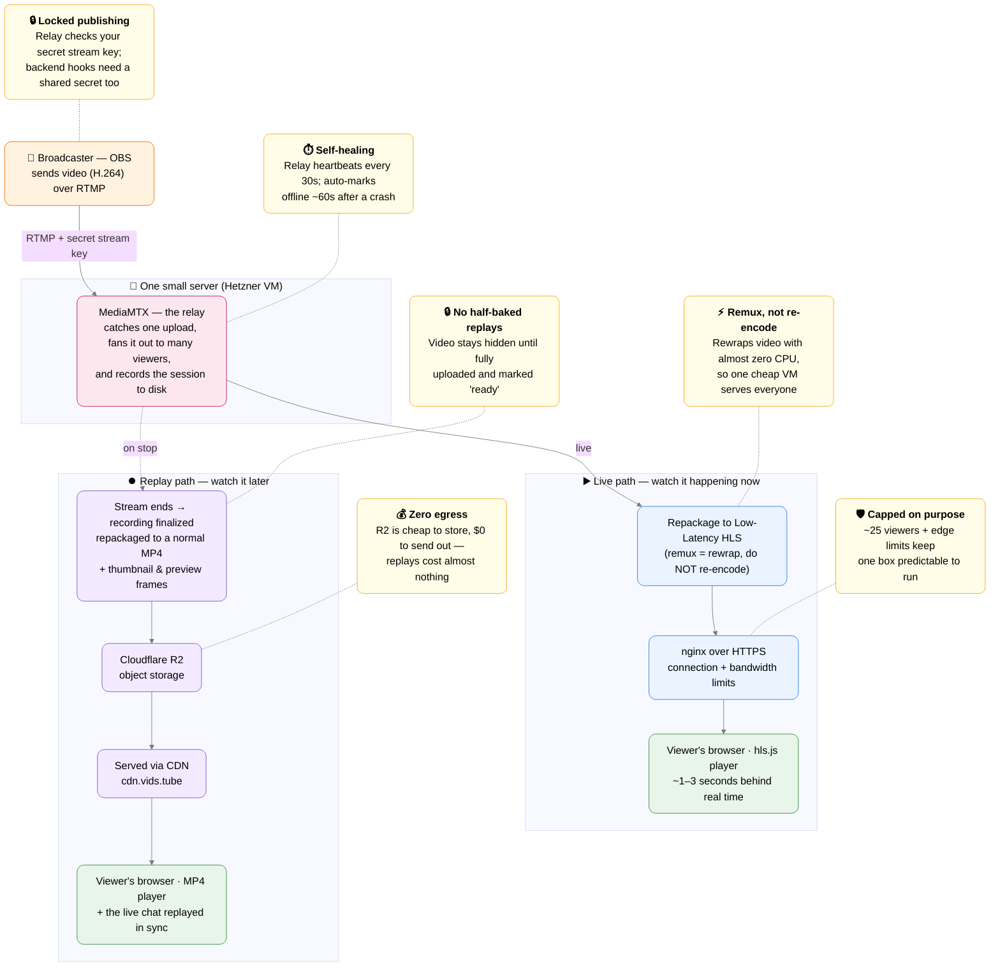

# Vids.Tube — How the video gets from you to viewers

A mid-level technical look at the two pipelines that make Vids.Tube work: **live streaming** (watch it now) and **VOD / replays** (watch it later). Auth, channels, and the rest are left out on purpose — this is the video journey, simplified, with the interesting engineering and security calls highlighted.

For the full developer reference see [architecture.md](architecture.md); for the beginner stream walkthrough see [architecture-walkthrough.md](architecture-walkthrough.md).

## The journey in plain technical terms

**Live (watch it now):**
1. **OBS → RTMP.** Your streaming software encodes the camera to H.264 video and pushes it to the server over RTMP, the standard "send a stream" protocol.
2. **MediaMTX, the relay.** One open-source server catches your single upload and is responsible for sending it out to everyone — so you upload once, not once-per-viewer.
3. **Repackage to Low-Latency HLS.** The relay *remuxes* the stream — rewraps the exact same video bytes into small HTTP chunks browsers can play. Crucially it does **not re-encode**, so CPU stays near zero.
4. **nginx edge.** A standard HTTPS server in front applies connection and bandwidth limits, then hands the chunks to viewers.
5. **hls.js in the browser** stitches the chunks back into smooth video, landing ~1–3 seconds behind real time.

**VOD (watch it later):**
1. **Stream ends.** When you stop, the relay's recording is **finalized** — repackaged into a normal MP4, and a thumbnail plus a few preview frames are generated.
2. **Cloudflare R2.** The finished file is uploaded to object storage (a "hard drive in the cloud").
3. **CDN.** It's served from `cdn.vids.tube` so viewers download it fast from a nearby edge.
4. **Playback.** The browser plays the MP4, and the chat from that stream is **replayed in sync** as you scrub.

## The interesting bits worth pointing out

- 🔒 **Publishing is locked.** Nobody can hijack your channel to broadcast — the relay verifies a secret stream key before accepting video, and the backend's recording hooks require their own shared secret.
- ⚡ **Remux, not transcode.** Rewrapping video instead of re-encoding it is the whole reason one small, cheap VM can serve the audience — re-encoding would need far more (and pricier) hardware.
- 🛡️ **Caps are a feature.** The ~25-viewer limit plus edge connection/rate limits aren't a bug — they keep a single server's cost and load predictable while the platform is small.
- ⏱️ **Self-healing.** The relay sends a heartbeat every 30 seconds; if it ever crashes mid-stream, the stream marks itself offline within ~60 seconds instead of looking "live" forever.
- 🔒 **No half-baked replays.** A recording is invisible until it's fully uploaded and flagged `ready`. The database itself won't hand out a video that's still processing — so viewers never hit a broken/partial file.
- 💰 **Zero-egress storage.** R2 charges to *store* data but nothing to *send it out*. Bandwidth is usually the scary bill for video — here, serving replays is effectively free.
