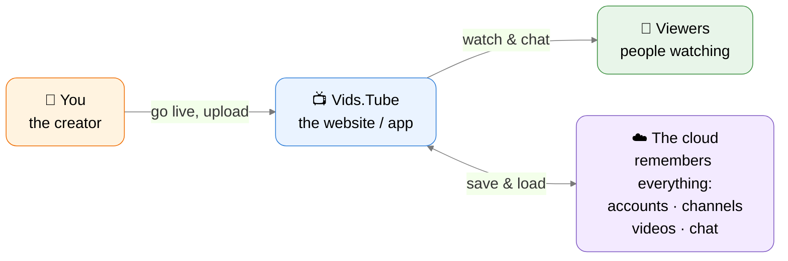
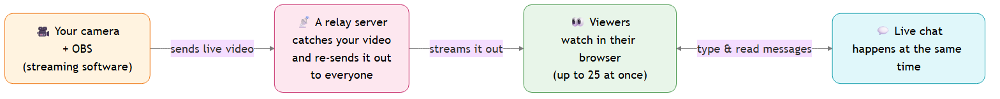
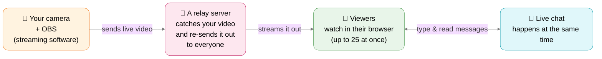
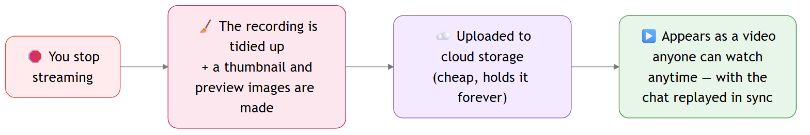
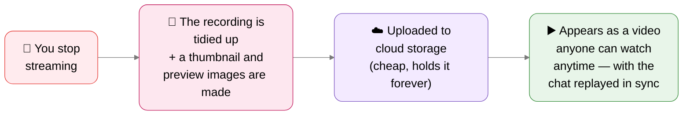
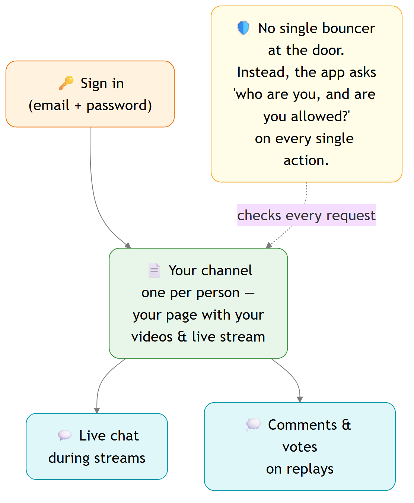
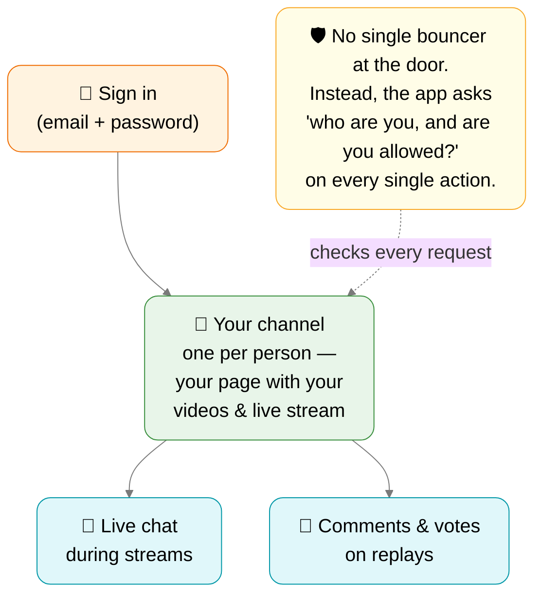

# Vids.Tube — How it works (a stream walkthrough)

A plain-language tour of how Vids.Tube is built, made to narrate live for people who are newer to coding. Four short chapters — click through one at a time. Each diagram has talking points underneath.

For the technical, developer-facing version, see [architecture.md](architecture.md).

---

## Chapter 1 — The big picture

**What to say:**
- Three players: **you** (the creator), the **app** (the website everyone opens), and the **viewers**.
- Behind the app is **"the cloud"** — think of it as the app's memory. It never forgets your account, your channel, your videos, or the chat.
- Everything else we'll look at is just *details of these arrows* — how the video gets from you to viewers, and how the cloud remembers it all.

---

## Chapter 2 — Going live

**What to say:**
- Your video doesn't go *straight* to viewers. It first hits one **relay server** — a single computer whose only job is to catch your stream and fan it back out.
- Why a relay? It means one upload from you instead of you sending video to every viewer separately.
- We **cap it at ~25 viewers** on purpose — keeps it small, friendly, and cheap to run while we're starting out.
- **Live chat runs alongside** the video — messages appear for everyone instantly.

---

## Chapter 3 — Becoming a replay

**What to say:**
- The moment you stop, the live recording gets **automatically tidied into a normal video file** — plus a thumbnail and a few preview frames for the seek bar.
- It's **uploaded to cloud storage** — a cheap "hard drive in the sky" that holds videos forever and serves them out for free.
- Then it just **shows up as a replay** on your channel. Bonus: the live chat from that stream is saved too, so it **replays in sync** as you scrub the video.
- Key idea: *live* and *replay* are two modes of the same stream — one is happening now, one is the saved copy.

---

## Chapter 4 — Accounts, channels & chat

**What to say:**
- You **sign in**, and you get **one channel** — your home page that holds your live stream and all your replays.
- Viewers join the **live chat** during a stream, and leave **comments** (with up/down votes) on replays afterwards.
- The security trick worth explaining: there's **no single "guard at the front door."** Instead, every time anyone clicks anything, the app re-checks *"who is this, and are they allowed to do this?"* — so even if someone pokes around, the database itself refuses anything they shouldn't see.

---

## Wrap-up (the whole story in one breath)

You go live → your video hits a **relay server** → viewers watch (and chat) in their browser → when you stop, the stream is **saved to the cloud** and becomes a **replay** → and the whole time, **the cloud remembers** your account, channel, videos, and chat, checking permissions on every step.
