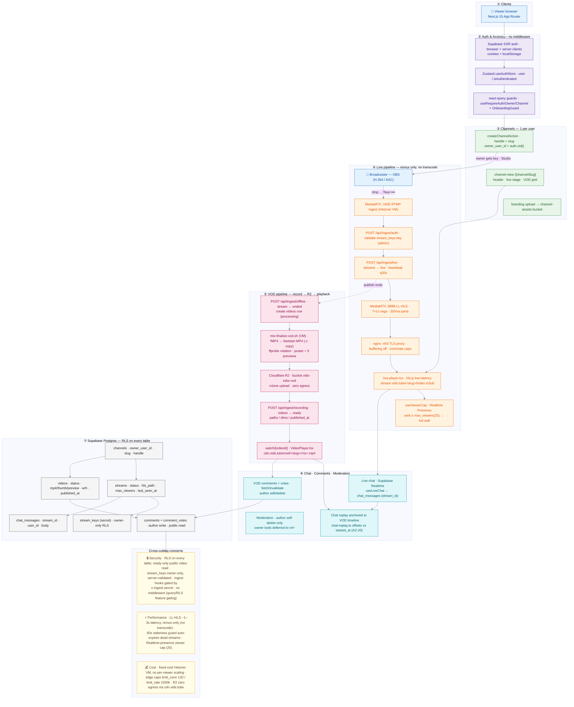

# Vids.Tube — Architecture

A community-driven, YouTube-style live + VOD platform. This document maps the implemented v1 system: authentication, channels, the live pipeline (OBS → MediaMTX → LL-HLS), the VOD pipeline (record → R2 → playback), chat/comments/moderation, and the Supabase data model — with security, performance, and cost notes annotated inline.

The diagram is a vertical (portrait) flowchart, suitable for rendering to an image and sharing on a vertical stream. Source of record is the Mermaid block below; the rendered image lives at [architecture.png](architecture.png). To regenerate the image, extract the Mermaid block to a `.mmd` file and run `npx -y @mermaid-js/mermaid-cli -i architecture.mmd -o architecture.png -b white -s 2`.

## How it works, in one pass

1. **Auth & access** — Supabase SSR (browser + server clients, cookie/localStorage sessions) feeds a Zustand `useAuthStore`. There is **no middleware**: route protection and feature gating are react-query hooks (`useRequireAuth`/`Owner`/`Channel`, `OnboardingGuard`) backed by Postgres RLS.
2. **Channels** — one channel per user (`owner_user_id` unique). `createChannelAction` writes `handle`/`slug` with `owner_user_id = auth.uid()`; `/[channelSlug]` renders the public channel view; branding uploads land in the `channel-assets` bucket.
3. **Live pipeline** — OBS pushes RTMP to **MediaMTX** on the Hetzner VM. `/api/ingest/auth` validates the stream key server-side; `/api/ingest/live` upserts the `streams` row to `live` and heartbeats `last_seen_at`. MediaMTX emits **LL-HLS** (7×1s segments, 200ms parts) behind an **nginx** TLS proxy (`buffering off`, connection + rate caps); the browser plays via hls.js. A Realtime-presence viewer cap (default 25) shows a "full" wall past capacity.
4. **VOD pipeline** — when publishing ends, `/api/ingest/offline` flips the stream to `ended` and creates a `videos` row (`processing`). The VM's `mtx-finalize-vod.sh` remuxes fMP4 → faststart MP4 (no transcode), probes rotation-aware dimensions, extracts a poster + 5 hover previews, and rclone-uploads to **Cloudflare R2**. `/api/ingest/recording` marks the video `ready`; viewers stream the MP4 from `cdn.vids.tube` (zero egress).
5. **Chat, comments, moderation** — live chat is **Supabase Realtime** over `chat_messages`; on VODs it replays anchored to the timeline (offsets vs `started_at`, AZ-20). VOD comments + votes are fetch/invalidate (not realtime) with author edit/delete. Moderation today is author self-delete only; owner tooling is deferred to v4+.
6. **Data model** — seven RLS-guarded tables: `channels`, `streams`, `stream_keys` (owner-only secret), `chat_messages`, `videos` (public read only when `ready`), and `comments`/`comment_votes`.

## Notes

- **Owner-run infra (not in this repo):** MediaMTX, nginx, and the rclone/R2 wiring run on the Hetzner VM per [runbooks/live-streaming-vm.md](runbooks/live-streaming-vm.md). Their hook scripts call the in-repo `/api/ingest/*` routes.
- **Not yet built:** the per-stream ticket monetization model (free delayed cast vs paid live+chat) and signed-URL segment gating — the edge connection cap currently covers the cost concern.
